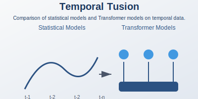

# Temporal Tussle

    

## Contents
- [Temporal Tussle](#temporal-tussle)
  - [Contents](#contents)
- [Benchmark the Time Series Models](#benchmark-the-time-series-models)
    - [About Dataset](#about-dataset)
      - [Summary on dataset](#summary-on-dataset)
    - [Models and Results](#models-and-results)
  - [Statistical Models](#statistical-models)
    - [1. **ARIMA (AutoRegressive Integrated Moving Average):**](#1-arima-autoregressive-integrated-moving-average)
    - [2. **SARIMA (Seasonal ARIMA):**](#2-sarima-seasonal-arima)
    - [3. **ETS (Error, Trend, Seasonality):**](#3-ets-error-trend-seasonality)
    - [4. **Theta Model:**](#4-theta-model)
    - [5. **Croston’s Method:**](#5-crostons-method)
  - [Neural Network Models](#neural-network-models)
    - [1. **N-Beats:**](#1-n-beats)
    - [2. **TimeGPT:**](#2-timegpt)
    - [3. **TFT (Temporal Fusion Transformer):**](#3-tft-temporal-fusion-transformer)
  - [Machine Learning Models](#machine-learning-models)
    - [1. **XGBoost:**](#1-xgboost)
    - [2. **LinearGAM (Generalized Additive Models):**](#2-lineargam-generalized-additive-models)
    - [Key Takeaways](#key-takeaways)
- [Triple Exponential Smoothing vs TimeGPT](#triple-exponential-smoothing-vs-timegpt)
  - [SellOut Dataset Overview](#sellout-dataset-overview)
    - [Dataset Characteristics](#dataset-characteristics)
    - [Time Range](#time-range)
    - [Dataset Summary](#dataset-summary)
  - [Analysis](#analysis)
    - [1. Segmentation- AX, BX, AY, BY](#1-segmentation--ax-bx-ay-by)
    - [2. AX, BX, AY, BY Distribution](#2-ax-bx-ay-by-distribution)
    - [3. Long and Short distribution of Items\_Ship\_To](#3-long-and-short-distribution-of-items_ship_to)
  - [Experiment](#experiment)
      - [Formulas](#formulas)
      - [Horizon 12](#horizon-12)
      - [Horizon 24](#horizon-24)
      - [Horizon 48](#horizon-48)
  - [Observations \& Results](#observations--results)
    - [To Do](#to-do)
  - [References](#references)

# Benchmark the Time Series Models

> [!NOTE] Files
> 1. [Bechnmarks sheet](Benchmarks.xlsx)
> 2. [EDA, arima, sarima, ets, theta](EDA,_arima,_sarima,_ets,_theta.ipynb)
> 3. [N-beats Noetbook](nbeats.ipynb)
> 4. [N-beats paper](N-BEATS.pdf)
> 5. [N-hiTS paper](N-hiTS.pdf)
> 6. Time Series Notes [Repo](https://github.com/vg11072001/Machine-Learning/tree/main/Time%20Series)

### About Dataset
- Daily Temperature of Major Cities

A dataset on the daily temperature of major cities worldwide can help analyze global warming trends. Additionally, weather data is invaluable for various data science tasks, such as:
- **Sales Forecasting**: Analyzing weather trends to predict product demand.
- **Logistics**: Optimizing supply chain operations based on weather patterns.

The dataset includes:
- **Daily average temperature values** recorded in major cities globally.
- **Format**: Separate `.txt` files for each city.

The dataset is provided by the University of Dayton and is available for research and non-commercial purposes only.  For more details, please refer to [this page]([#](http://academic.udayton.edu/kissock/http/Weather/default.htm)).

#### Summary on dataset
- Electricity production with daily records.  
- **Columns:** Date, 
- IPG2211A2N  
- **Total rows:** 12,054  
- **Train data:** 10,592  
- **Test data:** 1,462  

### Models and Results

| **Model**       | **Parameters Used**                                                                                   | **Package**          | **Forecasts at a Time** | **RMSE** | **MAE** | **MASE** | **MAPE** | **sMAPE** | **Runtime** | 
|------------------|-------------------------------------------------------------------------------------------------------|----------------------|-------------------------|----------|----------|----------|----------|-----------|-------------|
| **ARIMA**        | `order=(0, 1, 0)` using `auto_arima`                                                                  | Statsmodels          | Test data               | 14.24    | 11.84    | 42.38    | 12.27    | 11.26     | 0.4s        |
| **SARIMA**       | Seasonal order = 12                                                                                   | Statsmodels          | Test data               | 14.24    | 11.84    | 42.38    | 12.27    | 11.26     | 0.6s        |
| **ETS**          | `trend='add', seasonal='add', seasonal_periods=12`                                                    | Statsmodels          | Test data               | 16.58    | 14.13    | 50.57    | 14.59    | 13.23     | 2.2s        |
| **Theta**        | Test data                                                                                             | Statsmodels          | Test data               | 15.48    | 12.97    | 46.41    | 13.44    | 12.25     | 4.7s        |
| **Croston**      | Version = "optimized"                                                                                | Darts                | Test data               | 14.24    | 11.84    | 42.36    | 12.28    | 11.26     | 1.3s        |
| **N-Beats**      | Best model fit, Early stopping, learning rate, max_prediction_length = 24                             | PyTorch Forecasting  | 24                      | 2.73     | 0.8      | 0.66     | 0.65     | 0.67      | 68.2s       |
| **TimeGPT**      | `h=12, 24, 48`, `freq='D'`                                                                           | TimeGPT              | 12, 24, 48              | 10.41    | 8.5      | 4        | 8.27     | 8.82      | 14s         |
| **TFT**          | Time issue                                                                                           | PyTorch Forecasting  | Test data               |          |          |          |          |           |             |
| **XGBoost**      | `objective='reg:squarederror', n_estimators=1000`, converted TS to supervised learning                | XGBoost              | Test data               | 1.9      | 0.57     | 2.05     | 0.54     | 0.54      | 1200s       |

The dataset consists of daily electricity production records, with **12,054 total rows** divided into **training (10,592 rows)** and **testing (1,462 rows)**. Various models were evaluated for their performance in forecasting future electricity production values. These models include both statistical approaches and machine learning methods. Below is a summary of the models and their results:

## Statistical Models

### 1. **ARIMA (AutoRegressive Integrated Moving Average):**
- A widely used statistical model for time series forecasting, utilizing `auto_arima` for optimal parameter selection.
- **Performance:**
  - RMSE: 14.24
  - MAPE: 12.27%

### 2. **SARIMA (Seasonal ARIMA):**
- An extension of ARIMA incorporating seasonality with a seasonal order of 12.
- **Performance:**
  - RMSE: 14.24
  - MAPE: 12.27%

### 3. **ETS (Error, Trend, Seasonality):**
- A classical forecasting method with additive trend and seasonality components.
- **Performance:**
  - RMSE: 16.58
  - MAPE: 14.59%

### 4. **Theta Model:**
- A simple yet effective statistical model for time series forecasting.
- **Performance:**
  - RMSE: 15.48
  - MAPE: 13.44%

### 5. **Croston’s Method:**
- Optimized for intermittent demand data, showing performance comparable to ARIMA.
- **Performance:**
  - RMSE: 14.24
  - MAPE: 12.28%

## Neural Network Models

### 1. **N-Beats:**
- A deep learning model designed for long-term time series forecasting, trained using PyTorch Forecasting.
- **Performance:**
  - RMSE: 2.73
  - MAPE: 0.65%

### 2. **TimeGPT:**
- A proprietary time-series-specific Transformer-based model, offering multi-horizon forecasting for 12, 24, and 48 steps.
- **Performance:**
  - RMSE: 10.41
  - MAPE: 8.27%

### 3. **TFT (Temporal Fusion Transformer):**
- A powerful model for handling complex temporal relationships.
- **Challenges:** Encountered runtime and time-issue challenges, making its evaluation incomplete.

## Machine Learning Models

### 1. **XGBoost:**
- A tree-based gradient boosting model applied to a supervised learning transformation of the time series data.
- **Performance:**
  - RMSE: 1.9
  - MAPE: 0.54%

### 2. **LinearGAM (Generalized Additive Models):**
- A linear regression-based model for handling non-linear relationships.
- **Performance:** Results not reported but could provide interpretable results.

### Key Takeaways

- Machine learning models like XGBoost and deep learning models such as N-Beats exhibited superior performance compared to traditional statistical models.
- TimeGPT and Transformer-based approaches are promising for temporal data, especially for multi-horizon forecasting tasks.
- While statistical models like ARIMA and SARIMA are reliable and interpretable, they struggled to match the accuracy of advanced neural network and machine learning methods.
- Runtime and computational efficiency varied significantly, with statistical models being faster but neural networks and ensemble models offering better accuracy.

---

Reference:

- [time-series-analysis-and-forecasting](tutorial-time-series-analysis-and-forecasting.ipynb)

# Triple Exponential Smoothing vs TimeGPT

In this analysis, I compare the performance of the statistical model Triple Exponential Smoothing (TES) with the pretrained TimeGPT model for time series forecasting. Using the SellOut dataset, I evaluate both models across multiple forecasting horizons (12, 24, 48) and discuss their effectiveness in capturing trends, seasonal patterns, and handling long-term and short-term data variations. The comparison provides insights into the strengths and weaknesses of each model, specifically in terms of Mean Absolute Percentage Error (MAPE), Weighted Mean Absolute Percentage Error (WMAPE), and Accuracy MAPE.

> [!NOTE] Files
> 1. [SellOut_experimentation_12_LT.ipynb](SellOut_experimentation_12_LT.ipynb)
> 2. [ActualInput_experimentation](ActualInput_experimentation.xlsx)
> 3. [TimeGPT paper](timegpt.pdf)
> 3. [TimeGPT notebook](project_timegpt.ipynb)
> 4. [Triple Exponential Smoothing paper](TripleExponentialSmoothing.pdf)

## SellOut Dataset Overview

The SellOut dataset contains detailed records of sales data. Below is a summary of the key characteristics of the dataset:

### Dataset Characteristics

- **Total Rows:** 8,100,936
- **Columns:**
  - **Item:** 214,602 unique items
  - **Day:** From 2017-05-11 to 2022-03-31
  - **Ship To:** 6 unique shipping locations
  - **Location:** 1 unique location
  - **Actual Input:** 8,100,936 records
  
### Time Range

- The data spans from **2017-05-11** to **2022-03-31**, covering a range of almost 5 years of sales information.

### Dataset Summary

- The dataset contains multiple features to analyze sales trends, item performance, and shipping patterns.
- With 8,100,936 entries, it offers a comprehensive overview of sales transactions across multiple items and locations.

## Analysis

### 1. Segmentation- AX, BX, AY, BY		
        
- Volume(Sum_Actual_Input) > 80%	

### 2. AX, BX, AY, BY Distribution		
        

### 3. Long and Short distribution of Items_Ship_To
- Long Term and Short Term

## Experiment

1. I compared **TimeGPT** to **TES** in **Univariate Time Series** analysis.
2. Analysis and forecasting were performed on **Weekly * Item * Ship To** level.
3. I performed segmentation and took these 9 combinations:  
   `{AX_1, AX_2, AX_3, BX_1, BX_2, AY_1, AY_2, BY_1, BY_2}`, and used the forecasting horizons (H) = 12, 24, 48.
4. I divided the dataset into **Short Term (ST)** and **Long Term (LT)** duration of an **Item_Ship_To (ID)** and took 5 additional combinations:  
   `{LT_1, LT_2, LT_3, ST_1, ST_2}`, used with **H = 12**.

 - Experiment Dataset: Time Series Analysis (TES vs TimeGPT)

- AX: High Volume, Low Variance | BX: Low Volume, Low Variance | LT: Long Term  
- BY: Low Volume, High Variance | AY: High Volume, High Variance | ST: Short Term  

#### Formulas

- **mape** =
 
$$ \frac{\lvert \text{actual} - \text{forecast} \rvert}{\text{actual}} $$

- **WMAPE** =
 
$$ \frac{1}{n} \sum_{i=1}^{n} \left( \frac{\lvert \text{Actual}_i - \text{Forecasted}_i \rvert}{\text{Actual}_i} \right) \times 100 $$

- **Accuracy (MAPE)** =
$$ 1 - \left( \frac{\sum_{i=1}^{n} \lvert \text{actual}_i - \text{forecast}_i \rvert}{\sum_{i=1}^{n} \text{actual}_i} \right) \times 100 $$

#### Horizon 12

| **ID** | **Columns** | **No. of Zero (Weekly)** | **Duration** | **LT or ST** | **Mape(TES)** | **AccMape(TES)** | **WMAPE(TES)** | **Mape(TimeGPT)** | **AccMape(TimeGPT)** | **WMAPE(TimeGPT)** | **Mape (TES - TimeGPT)** | **Accuracy (TimeGPT - TES)** | **WMAPE (TES - TimeGPT)** | **Comment** | **Reason Observed from Graph** |
|--------|-------------|--------------------------|--------------|--------------|---------------|------------------|----------------|--------------------|----------------------|-------------------|----------------------------|----------------------------|----------------------------|------------|-----------------------------|
| AX_1   | 1421581000_100115 | 198 | 41 | 1378 | 0.114707 | 89.643223 | 0.103568 | 0.140113 | 87.167367 | 0.128326 | -0.025406 | -2.475856 | -0.024758 | Both good, TES a bit better | |
| AX_2   | 1369131002_200002 | 221 | 64 | 1541 | 0.352284 | 59.293379 | 0.407066 | 0.333012 | 62.510168 | 0.374898 | 0.019272 | 3.216789 | 0.032168 | Both good, TimeGPT a bit better | |
| AX_3   | 3471852000_100115 | 199 | 31 | 1385 | 0.322225 | 74.543901 | 0.254561 | 0.318061 | 74.530493 | 0.254695 | 0.004164 | -0.013408 | -0.000134 | Both good | |
| BX_1   | 3523065004_200003 | 103 | 27 | 714 | 0.323693 | 64.017272 | 0.359827 | 0.351726 | 63.349912 | 0.366501 | -0.028033 | -0.66736 | -0.006674 | Both good, TES a bit better | |
| BX_2   | 2648859_100115 | 65 | 2 | 451 | 0.364936 | 63.130527 | 0.368695 | 0.347848 | 70.776962 | 0.29223 | 0.017088 | 7.646435 | 0.076465 | Both good, TimeGPT a bit better | |
| BY_1   | 3527422005_200003 | 103 | 36 | 712 | 20.381798 | -15.142556 | 1.151426 | 148.643737 | 32.255306 | 0.677447 | -128.261939 | 47.397862 | 0.473979 | Both Bad | A lot of rise and fall in values |
| BY_2   | 3947472000_100115 | 125 | 57 | 870 | 0.44089 | 55.5096 | 0.444904 | 0.823465 | 40.413143 | 0.595869 | -0.382575 | -15.096457 | -0.150965 | Both Bad | A lot of rise and fall in values |
| AY_1   | 671320007_100115 | 198 | 74 | 1382 | 0.191614 | 81.062789 | 0.189372 | 0.37973 | 70.007657 | 0.299923 | -0.188116 | -11.055132 | -0.110551 | Both good, TES a bit better | In comparison above, less variation |
| AY_2   | 1369159000_200006 | 222 | 82 | 1548 | 0.27424 | 76.663025 | 0.23337 | 0.242972 | 74.300886 | 0.256991 | 0.031268 | -2.362139 | -0.023621 | Both good, TES a bit better | |
| **Horizon** | 12 | | | | | | | | | | | | | |

#### Horizon 24

| **ID** | **Columns** | **No. of Zero (Weekly)** | **Duration** | **LT or ST** | **Mape(TES)** | **AccMape(TES)** | **WMAPE(TES)** | **Mape(TimeGPT)** | **AccMape(TimeGPT)** | **WMAPE(TimeGPT)** | **Mape (TES - TimeGPT)** | **Accuracy (TimeGPT - TES)** | **WMAPE (TES - TimeGPT)** | **Comment** |
|--------|-------------|--------------------------|--------------|--------------|---------------|------------------|----------------|--------------------|----------------------|-------------------|----------------------------|----------------------------|----------------------------|------------|
| AX_1   | 1421581000_100115 | 198 | 41 | 1378 | 0.322019 | 78.357107 | 0.216429 | 0.337344 | 72.531382 | 0.274686 | -0.015325 | -5.825725 | Both good, TES a bit better | |
| AX_2   | 1369131002_200002 | 221 | 64 | 1541 | 0.354733 | 67.099779 | 0.329002 | 1.112151 | 23.380537 | 0.766195 | -0.757418 | -43.719242 | TES a better | |
| AX_3   | 3471852000_100115 | 199 | 31 | 1385 | 0.328702 | 67.436491 | 0.325635 | 0.332935 | 64.679209 | 0.353208 | -0.004233 | -2.757282 | Both Average, TES a bit better | |
| BX_1   | 3523065004_200003 | 103 | 27 | 714 | 0.370099 | 65.491198 | 0.345088 | 0.374063 | 70.889004 | 0.29111 | -0.003964 | 5.397806 | Both Average, TimeGPT a bit better | |
| BX_2   | 2648859_100115 | 65 | 2 | 451 | 0.893372 | 27.592161 | 0.724078 | 26.001794 | 65.984794 | 0.340152 | -25.108422 | 38.392633 | TES Bad, TimeGPT average | A lot of rise and fall in values |
| BY_1   | 3527422005_200003 | 103 | 36 | 712 | 31.897558 | 28.834183 | 0.711658 | 117.690571 | 49.419321 | 0.505807 | -85.793013 | 20.585138 | Both Bad, TimeGPT caught its trend | A lot of rise and fall in values |
| BY_2   | 3947472000_100115 | 125 | 57 | 870 | 10.247373 | -61.686565 | 1.616866 | 86.5333 | 48.344276 | 0.516557 | -76.285927 | 110.030841 | TES Bad, TimeGPT average | In comparison above, less variation |
| AY_1   | 671320007_100115 | 198 | 74 | 1382 | 0.532795 | 54.388814 | 0.456112 | 0.422792 | 68.303856 | 0.316961 | 0.110003 | 13.915042 | Both Average, TimeGPT a bit better | |
| AY_2   | 1369159000_200006 | 222 | 82 | 1548 | 63.66828 | -0.977009 | 1.00977 | 267.985979 | 0.446761 | 0.995532 | -204.317699 | 1.42377 | Both Bad | |
| **Horizon** | 24 | | | | | | | | | | | | | | |

#### Horizon 48

| **ID** | **Columns** | **No. of Zero (Weekly)** | **Duration** | **LT or ST** | **Mape(TES)** | **AccMape(TES)** | **WMAPE(TES)** | **Mape(TimeGPT)** | **AccMape(TimeGPT)** | **WMAPE(TimeGPT)** | **Mape (TES - TimeGPT)** | **Accuracy (TimeGPT - TES)** | **WMAPE (TES - TimeGPT)** | **Comment** |
|--------|-------------|--------------------------|--------------|--------------|---------------|------------------|----------------|--------------------|----------------------|-------------------|----------------------------|----------------------------|----------------------------|------------|
| AX_1   | 1421581000_100115 | 198 | 41 | 1378 | 0.321219 | 76.834992 | 0.218209 | 0.318866 | 72.451211 | 0.294257 | 0.002353 | 4.383784 | Both good, TES a bit better | |
| AX_2   | 1369131002_200002 | 221 | 64 | 1541 | 0.37551 | 67.621699 | 0.295125 | 0.506503 | 58.696086 | 0.469579 | -0.130993 | -8.925613 | Both good, TimeGPT a bit better | |
| AX_3   | 3471852000_100115 | 199 | 31 | 1385 | 0.356587 | 68.798366 | 0.298271 | 0.306508 | 69.29568 | 0.294524 | 0.050079 | -0.497314 | Both Average, TES better | |
| BX_1   | 3523065004_200003 | 103 | 27 | 714 | 0.38994 | 63.968181 | 0.33556 | 0.328617 | 67.968015 | 0.299489 | 0.061323 | 4.063831 | Both Average | |
| BX_2   | 2648859_100115 | 65 | 2 | 451 | 0.432795 | 77.306215 | 0.432795 | 0.306577 | 72.160065 | 0.311768 | 0.126218 | 5.146148 | Both Average, TimeGPT a bit better | |
| BY_1   | 3527422005_200003 | 103 | 36 | 712 | 0.282746 | 65.373245 | 0.300602 | 0.328004 | 56.453918 | 0.470819 | -0.045258 | -8.635327 | TES a bit better | |
| BY_2   | 3947472000_100115 | 125 | 57 | 870 | 0.399085 | -45.315833 | 1.23114 | 0.408559 | -43.026731 | 1.40566 | -0.009474 | -2.289102 | Both Average | |
| AY_1   | 671320007_100115 | 198 | 74 | 1382 | 0.551383 | 72.125623 | 0.385269 | 0.382823 | 69.315058 | 0.347658 | 0.16856 | 2.810565 | Both Average, TimeGPT a bit better | |
| AY_2   | 1369159000_200006 | 222 | 82 | 1548 | 0.428926 | 51.404569 | 0.34749 | 0.355742 | 50.713168 | 0.318084 | 0.073184 | 0.691401 | Both good | |

## Observations & Results

1. For **H = 12**, observed good evaluation values for **'Item_Ship_To' (ID)** intersections from **AX, BX** sets by both models, with a slight difference. (For more details, refer to attachment.)
2. For **H = 24**, **TimeGPT** is average, while **TES** shows slightly better results. For **H = 48**, **TimeGPT** is average, and **TES** performs better for **AX, BX**. (For more details, refer to attachment.)
3. Both **TES** and **TimeGPT** performed poorly on **BY**.
4. **TimeGPT** cannot spot sudden shifts despite having some historical evidence in the data. It tends to provide average values during these events.
5. **TimeGPT** captures a good trend from intersections in the **9*3** combinations, especially when there is rich long-term data.

Further analysis is required to understand is availabel in sheet
- [ActualInput_experimentation](ActualInput_experimentation.xlsx)
- 

### To Do

- [x] **WMape**
- [x] Test and train graph on the same dataset
- [x] **Prophet** and **ARIMA**
- [ ] Exogenous variable using **TimeGPT**
- [ ] Explore other possibilities with **TimeGPT**

## References
- https://github.com/Nixtla/nixtla
- https://www.nixtla.io/open-source
- https://www.researchgate.net/publication/- 235618253_Multi-scale_Internet_traffic_forecasting_using_neural_networks_and_- time_series_methods
- https://otexts.com/fpp2/intro.html
